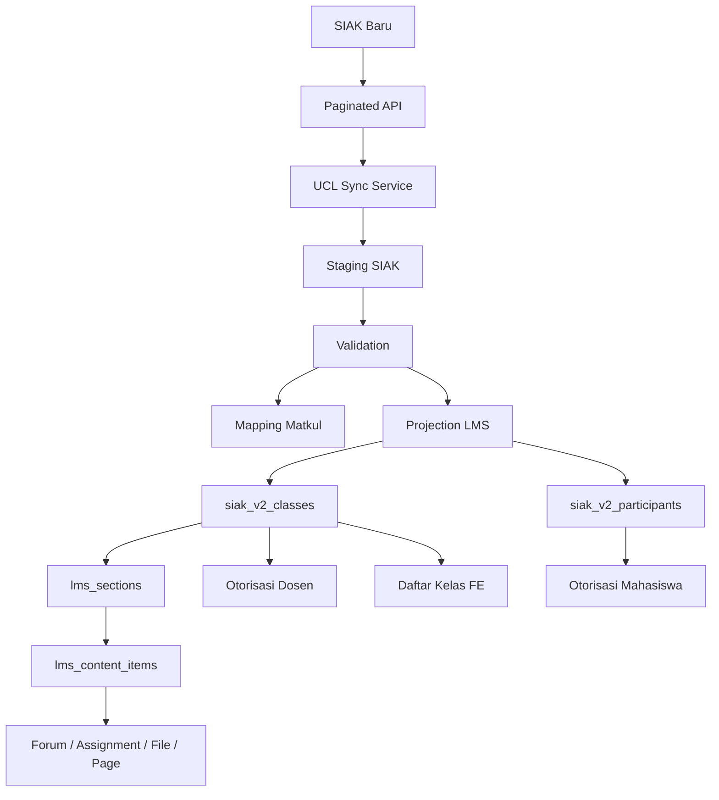
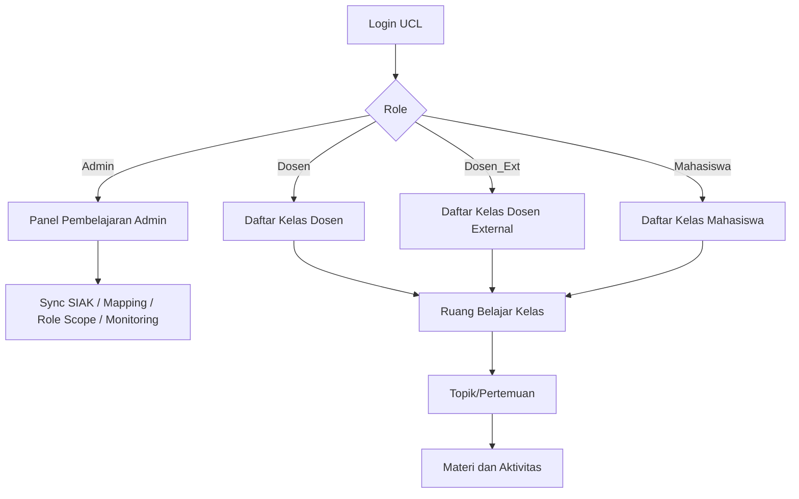

# Master Plan LMS UCL SPADA-style

Dokumen ini merangkum alur, rencana, batasan, dan strategi implementasi Modul Pembelajaran
atau LMS UCL. Dokumen ini dibuat sebagai bahan brainstorming dengan Claude AI, tim SIAK,
tim UCL/TIAS, dan pihak akademik.

## 1. Ringkasan Utama

LMS yang akan diterapkan di UCL bukan sekadar halaman upload materi. Konsep produk yang
dituju adalah **LMS SPADA-style untuk UCL**.

Artinya, pengalaman belajar mengikuti pola:

```text
Pilih kelas kuliah
  -> Masuk ruang belajar kelas
  -> Lihat topik/pertemuan/minggu
  -> Akses aktivitas atau sumber belajar
  -> Dosen mengelola, mahasiswa mengikuti, admin memantau
```

Fokus utamanya:

- Kelas kuliah menjadi pintu masuk utama.
- Struktur pembelajaran berbasis topik, pertemuan, atau minggu.
- Setiap topik berisi aktivitas dan sumber belajar.
- Dosen mengelola konten kelas yang dia ampu.
- Mahasiswa hanya melihat/mengikuti kelas yang dia ambil.
- Admin melihat dan memantau sesuai scope universitas, fakultas, atau prodi.
- Data kelas, prodi, fakultas, dosen, mahasiswa, dan jadwal berasal dari SIAK baru.
- LMS menyimpan data SIAK secara lokal melalui mekanisme sync, bukan live proxy.

Catatan penting: ini **SPADA-style**, bukan klaim sebagai SPADA resmi Kemdikbud dan bukan
otomatis integrasi aggregator/pelaporan Kemdikbud. Jika suatu hari dibutuhkan integrasi resmi,
itu menjadi pekerjaan terpisah.

## 2. Tujuan Dokumen

Dokumen ini dipakai untuk:

- Menyamakan pemahaman bahwa LMS UCL mengikuti pola SPADA-style.
- Menjelaskan alur data dari SIAK baru ke UCL.
- Menjelaskan alur user dari admin, dosen, dosen external, dan mahasiswa.
- Menjelaskan role dan scope admin LMS.
- Menjelaskan rencana frontend dan backend.
- Menjadi bahan diskusi dengan Claude AI agar tidak salah arah saat memberi saran.

## 3. Prinsip Produk

### 3.1 LMS sebagai ruang belajar

LMS harus terasa seperti ruang belajar digital, bukan hanya dashboard CRUD.

Satu kelas kuliah harus bisa memuat:

- Informasi mata kuliah.
- Nama kelas.
- Semester akademik.
- Dosen pengampu.
- Jadwal.
- Prodi dan fakultas.
- Daftar topik/pertemuan.
- Materi dan aktivitas belajar.

### 3.2 Struktur mirip SPADA

Struktur utama:

```text
Kelas Kuliah
  -> Topik/Pertemuan/Minggu
       -> Page
       -> PDF
       -> PPT
       -> Video
       -> URL
       -> Forum
       -> Assignment
       -> Exam/Quiz
```

Topik bisa dipakai sebagai:

- Pertemuan 1, Pertemuan 2, dst.
- Minggu 1, Minggu 2, dst.
- Topik tematik seperti "Pengantar", "Basis Data Relasional", dll.

### 3.3 Backend tetap menjadi sumber keamanan

Frontend boleh menyembunyikan menu atau tombol, tetapi keputusan akses tetap harus dari
backend.

Contoh:

- Mahasiswa tidak boleh melihat kelas yang tidak dia ambil.
- Dosen tidak boleh mengelola kelas yang tidak dia ampu.
- Admin prodi tidak boleh melihat kelas prodi lain.
- Admin fakultas tidak boleh melihat fakultas lain.

## 4. Scope dan Non-scope

### 4.1 Masuk scope LMS

Yang masuk scope:

- Daftar kelas LMS.
- Detail ruang belajar kelas.
- Topik/pertemuan.
- Materi page.
- File PDF.
- File PPT.
- Video.
- Link URL.
- Forum diskusi.
- Assignment/tugas.
- Exam/quiz sebagai backlog setelah modul inti stabil.
- Role scope admin LMS.
- Sync data akademik dari SIAK baru.
- Mapping mata kuliah lokal ke mata kuliah SIAK baru.
- Report/monitoring LMS sesuai scope admin.

### 4.2 Di luar scope langsung

Yang tidak dikerjakan sebagai inti awal:

- Mengganti total sistem absensi lama.
- Menghapus `m_matakuliah`.
- Menjadikan UCL sebagai SPADA resmi Kemdikbud.
- Integrasi aggregator/pelaporan eksternal.
- Setor nilai final ke SIAK sebelum format nilai dan mekanisme disepakati.
- Mengubah besar-besaran manajemen user lama.
- Membuat engine CBT dari nol jika sudah ada/akan ada modul CBT terpisah.

## 5. Aktor dan Role

### 5.1 Admin global

Admin global adalah role `Admin` di UCL/TIAS.

Hak:

- Menjalankan sync SIAK.
- Melihat hasil validasi sync.
- Mengelola mapping mata kuliah.
- Mengelola scope admin LMS.
- Melihat semua kelas.
- Membantu mengelola konten jika dibutuhkan.

Catatan:

- Role ini kuat, jadi harus dibatasi untuk user tertentu.
- Endpoint sensitif seperti sync dan mapping tetap memakai admin global.

### 5.2 LMS Admin Univ

Admin universitas khusus LMS.

Hak:

- Melihat semua kelas LMS.
- Melihat report/monitoring semua kelas.

Batasan:

- Tidak otomatis boleh menjalankan sync SIAK.
- Tidak otomatis boleh mengubah materi dosen.

### 5.3 LMS Admin Fakultas

Admin LMS pada level fakultas.

Hak:

- Melihat kelas dalam fakultas yang ditugaskan.
- Melihat report/monitoring fakultas tersebut.

Sumber scope:

```text
lms_role_scopes.fakultas_id
  -> siak_sync_study_programs.fakultas_id
  -> siak_sync_classes.prodi_id
```

### 5.4 LMS Admin Prodi

Admin LMS pada level prodi.

Hak:

- Melihat kelas pada prodi yang ditugaskan.
- Melihat report/monitoring prodi tersebut.

Sumber scope:

```text
lms_role_scopes.prodi_id
  -> siak_sync_classes.prodi_id
```

### 5.5 Dosen

Dosen adalah pengampu kelas.

Hak:

- Melihat kelas yang dia ampu.
- Membuat topik/pertemuan.
- Menambah, edit, hapus, publish/unpublish materi.
- Mengelola forum kelas.
- Mengelola assignment.

Otorisasi:

```text
req.user.nip
  -> dicocokkan dengan data dosen pengampu pada kelas
```

### 5.6 Dosen external

Dosen external diperlakukan seperti dosen untuk kelas yang dia ampu.

Hak:

- Sama seperti dosen, tetapi hanya pada kelas yang cocok dengan NIP/identitasnya.

Catatan:

- Perlu memastikan format identitas dosen external sama dengan data dari SIAK.

### 5.7 Mahasiswa

Mahasiswa adalah peserta kelas.

Hak:

- Melihat kelas yang dia ambil.
- Melihat materi yang dipublish.
- Membuka file dan link.
- Mengikuti forum.
- Submit assignment.
- Mengikuti quiz/exam jika tersedia.

Otorisasi:

```text
req.user.npm
  -> dicocokkan dengan peserta kelas dari SIAK
```

## 6. Konsep Data Utama

### 6.1 Kelas kuliah

Kelas kuliah adalah anchor utama LMS.

Field paling penting:

```text
kelasKuliahId
mataKuliahId
prodiId
semester
namaKelas
isActive
```

`kelasKuliahId` harus stabil dan unik per kelas kuliah.

### 6.2 Mata kuliah

Mata kuliah dari SIAK baru tidak langsung mengganti `m_matakuliah`.

Alasan:

- Sistem lama masih memakai `m_matakuliah`.
- Absensi masih punya relasi ke `m_matakuliah`.
- Penggantian langsung berisiko memutus data lama.

Strategi:

```text
SIAK baru courses
  -> siak_sync_courses
  -> matakuliah_siak_mapping
  -> m_matakuliah
```

### 6.3 Topik/pertemuan

Topik/pertemuan disimpan di `lms_sections`.

Fungsi:

- Mengelompokkan materi.
- Menjadi struktur utama ruang belajar.
- Bisa merepresentasikan pertemuan 1 sampai 16.

### 6.4 Content item

Content item disimpan di `lms_content_items`.

Jenis item:

```text
page
pdf
ppt
video
url
forum
assignment
exam
```

### 6.5 Forum

Forum adalah aktivitas dalam kelas, bukan menu global yang berdiri sendiri.

Struktur:

```text
lms_content_items(type = forum)
  -> lms_forum_threads
       -> lms_forum_posts
```

### 6.6 Role scope

Scope admin LMS disimpan di:

```text
lms_role_scopes
```

Role scope:

```text
lms_admin_univ
lms_admin_fakultas
lms_admin_prodi
```

## 7. Sumber Data dan Source of Truth

### 7.1 SIAK baru

SIAK baru menjadi sumber utama untuk:

- Fakultas.
- Prodi.
- Kurikulum.
- Mata kuliah.
- Kelas kuliah.
- Dosen pengampu.
- Jadwal kelas.
- Peserta kelas.

### 7.2 UCL/TIAS lokal

UCL menyimpan data SIAK ke tabel lokal agar:

- LMS cepat.
- Akses tidak tergantung API SIAK setiap halaman dibuka.
- Otorisasi bisa dilakukan via database lokal.
- Sistem tetap bisa dibuka jika API SIAK sedang lambat/down.

### 7.3 Sistem lama

Sistem lama tetap ada, terutama:

- `m_matakuliah`.
- `m_kurikulum`.
- `pembelajaran_dosen_ext`.
- `absensi_mhs`.

Sistem lama tidak langsung diganti agar data presensi dan relasi historis tetap aman.

## 8. Arsitektur Sync SIAK

### 8.1 Prinsip full sync

UCL tidak melakukan live proxy ke SIAK pada setiap request user.

Alur yang dipakai:

```text
Admin klik sync
  -> UCL mengambil data SIAK secara paginated
  -> Data disimpan ke staging UCL
  -> UCL menjalankan validasi
  -> Jika valid, data diproyeksikan ke tabel LMS lokal
  -> User LMS membaca data lokal
```

### 8.2 Resource SIAK yang dibutuhkan

Resource minimum:

```text
faculties
study-programs
curriculums
courses
classes
class-lecturers
class-schedules
class-participants
```

### 8.3 Format pagination

Format yang disarankan:

```json
{
  "data": [],
  "meta": {
    "page": 1,
    "perPage": 500,
    "total": 1200,
    "lastPage": 3,
    "hasNext": true
  }
}
```

Minimal yang wajib ada:

```text
data
meta.page
meta.perPage
meta.hasNext
```

Jika `total` dan `lastPage` belum tersedia, `hasNext` wajib ada agar sync bisa tahu kapan berhenti.

### 8.4 Urutan sync

Urutan sync harus menjaga relasi:

```text
1. faculties
2. study-programs
3. curriculums
4. courses
5. classes
6. class-lecturers
7. class-schedules
8. class-participants
```

### 8.5 Tabel staging

Tabel staging:

```text
siak_sync_runs
siak_sync_faculties
siak_sync_study_programs
siak_sync_curriculums
siak_sync_courses
siak_sync_classes
siak_sync_class_lecturers
siak_sync_class_schedules
siak_sync_class_participants
matakuliah_siak_mapping
```

### 8.6 Projection ke LMS

Setelah staging valid, data diproyeksikan ke tabel LMS lokal:

```text
siak_sync_classes
  -> siak_v2_classes

siak_sync_class_participants
  -> siak_v2_participants
```

Alasannya:

- `lms_sections` saat ini sudah berelasi ke `siak_v2_classes.kelasKuliahId`.
- Kontrak internal LMS tetap stabil.
- Upstream bisa berganti dari mock ke SIAK baru tanpa mengubah struktur LMS.

## 9. Alur Backend Utama

### 9.1 Sync dari SIAK ke staging

Endpoint:

```http
POST /siak-sync/sync
POST /siak-sync/sync/:resource
GET  /siak-sync/resources
```

Alur:

```text
Admin membuka panel sync
  -> FE memanggil GET /siak-sync/resources
  -> Admin klik sync semua atau per resource
  -> Backend membaca mock/api sesuai env
  -> Backend mengambil semua page
  -> Backend upsert ke staging
  -> Backend mencatat siak_sync_runs
```

### 9.2 Validasi hasil sync

Endpoint:

```http
GET /siak-sync/validation
```

Validasi:

- Sync terakhir tiap resource harus sukses.
- Prodi harus punya fakultas.
- Kurikulum harus punya prodi.
- Course harus punya prodi dan kurikulum.
- Class harus punya course dan prodi.
- Lecturer harus punya class dan NIP.
- Participant harus punya class dan NPM.
- Tidak boleh ada duplikasi class + NPM.
- Tidak boleh ada duplikasi class + NIP.
- Mapping lokal ke SIAK harus valid.

Konsep hasil:

```text
valid = total_errors == 0
ready_for_cutover = total_errors == 0 && total_warnings == 0
```

### 9.3 Mapping mata kuliah

Endpoint:

```http
GET    /siak-sync/course-mappings
POST   /siak-sync/course-mappings/auto
POST   /siak-sync/course-mappings
PATCH  /siak-sync/course-mappings/:id
DELETE /siak-sync/course-mappings/:id
```

Aturan auto-map:

- Kode mata kuliah lokal dan SIAK harus sama setelah trim dan uppercase.
- Kode harus unik di lokal dan SIAK.
- SKS harus sama, kecuali salah satu sumber belum mengirim SKS.
- Hasil auto-map tetap status `pending`.
- Admin harus verifikasi sebelum dianggap final.

### 9.4 Projection LMS

Endpoint:

```http
POST /lms/sync-siak
```

Alur:

```text
Ambil kelas dari staging
  -> Bentuk record siak_v2_classes
  -> Gabungkan dosen pengampu menjadi array NIP
  -> Ambil peserta dari staging
  -> Bentuk record siak_v2_participants
```

### 9.5 Daftar kelas LMS

Endpoint:

```http
GET /lms/classes?semester=20241&search=&page=1&limit=10
```

Filter backend:

- Admin global: semua kelas.
- LMS admin univ: semua kelas.
- LMS admin fakultas: kelas sesuai fakultas.
- LMS admin prodi: kelas sesuai prodi.
- Dosen/Dosen_Ext: kelas yang NIP-nya ada di dosen pengampu.
- Mahasiswa: kelas yang NPM-nya ada di peserta kelas.

### 9.6 Materi LMS

Endpoint inti yang sudah/akan dipakai:

```http
GET    /lms/sections?kelasKuliahId=:id
POST   /lms/sections
PUT    /lms/sections/:id
DELETE /lms/sections/:id
PATCH  /lms/sections/reorder

POST   /lms/sections/:sectionId/items
POST   /lms/sections/:sectionId/items/upload
PUT    /lms/items/:id
DELETE /lms/items/:id
PATCH  /lms/sections/:sectionId/items/reorder

GET    /lms/files/:id
```

### 9.7 Forum LMS

Endpoint:

```http
GET    /lms/items/:id/threads
POST   /lms/items/:id/threads
GET    /lms/threads/:threadId
PATCH  /lms/threads/:threadId
DELETE /lms/threads/:threadId
POST   /lms/threads/:threadId/posts
PUT    /lms/posts/:postId
DELETE /lms/posts/:postId
```

Aturan:

- Admin scoped boleh membaca forum.
- Membuat thread/post tetap untuk anggota kelas.
- Moderator forum adalah dosen pengampu atau admin global.

## 10. Alur Frontend

Repo frontend:

```text
D:\Belajar\fe-ucl
```

Kondisi saat ini:

- Next.js.
- Menu aktif memakai `src/config/MenuUpdate.js`.
- API LMS ada di `src/repo/lms.js`.
- Modul detail LMS ada di `src/modules/pembelajaran/lms`.
- Halaman detail kelas sudah ada untuk dosen dan mahasiswa:
  - `src/pages/dosen/pembelajaran/[kelasKuliahId].jsx`
  - `src/pages/mahasiswa/pembelajaran/[kelasKuliahId].jsx`

Yang perlu dibuat:

- Halaman daftar kelas LMS.
- Halaman detail LMS untuk admin.
- Halaman LMS untuk dosen external.
- Panel admin sync SIAK.
- Panel mapping mata kuliah.
- Panel role scope LMS.

### 10.1 Menu Pembelajaran

Menu `Pembelajaran` harus bisa diakses oleh:

```text
Admin
Dosen
Dosen_Ext
Mahasiswa
```

Submenu:

```text
Kelas LMS       -> semua role
Matakuliah      -> admin
Kurikulum       -> admin
Sync SIAK       -> admin
Mapping SIAK    -> admin
Role LMS        -> admin
```

### 10.2 Daftar kelas LMS

Halaman yang disarankan:

```text
src/pages/dosen/pembelajaran/index.jsx
src/pages/dosen_ext/pembelajaran/index.jsx
src/pages/mahasiswa/pembelajaran/index.jsx
src/pages/admin/pembelajaran/index.jsx
```

Komponen reusable:

```text
src/modules/pembelajaran/lms/ClassList.jsx
```

Isi daftar kelas:

- Nama mata kuliah.
- Kode mata kuliah.
- Nama kelas.
- Semester.
- Dosen pengampu.
- Prodi/fakultas.
- Jadwal ringkas.
- Jumlah peserta.
- Status materi.
- Tombol masuk kelas.

### 10.3 Detail kelas LMS

Detail kelas harus menampilkan:

- Header kelas.
- Info mata kuliah.
- Info dosen.
- Info jadwal.
- Daftar topik/pertemuan.
- Item materi per topik.
- Mode dosen untuk kelola.
- Mode mahasiswa untuk baca.

Alur dosen:

```text
Masuk daftar kelas
  -> Pilih kelas
  -> Tambah topik/pertemuan
  -> Tambah aktivitas/sumber belajar
  -> Publish materi
  -> Pantau forum/assignment
```

Alur mahasiswa:

```text
Masuk daftar kelas
  -> Pilih kelas
  -> Buka topik/pertemuan
  -> Baca materi
  -> Ikut forum
  -> Submit tugas
```

### 10.4 Admin sync SIAK

Panel admin harus memuat:

- Status resource SIAK.
- Tombol sync semua.
- Tombol sync per resource.
- Waktu sync terakhir.
- Jumlah row.
- Status validasi.
- Warning/error validasi.
- Tombol projection ke LMS.

Alur admin:

```text
Admin buka Pembelajaran -> Sync SIAK
  -> Klik Sync SIAK
  -> Cek validasi
  -> Cek mapping matkul
  -> Klik Sync ke LMS
  -> Cek daftar kelas LMS
```

### 10.5 Mapping matkul

Panel mapping menampilkan:

- Mata kuliah lokal.
- Mata kuliah SIAK.
- Kode.
- SKS.
- Status mapping.
- Tombol auto-map.
- Tombol verifikasi.
- Tombol reject.
- Form mapping manual.

### 10.6 Role scope

Panel role scope menampilkan:

- User admin.
- Role scope.
- Fakultas/prodi.
- Status aktif.
- Tombol tambah/edit/nonaktifkan.

## 11. Struktur Database Ringkas

### 11.1 Staging SIAK

```text
siak_sync_runs
siak_sync_faculties
siak_sync_study_programs
siak_sync_curriculums
siak_sync_courses
siak_sync_classes
siak_sync_class_lecturers
siak_sync_class_schedules
siak_sync_class_participants
```

### 11.2 Mapping

```text
matakuliah_siak_mapping
```

Relasi:

```text
m_matakuliah.id
  -> matakuliah_siak_mapping.local_matakuliah_id
  -> matakuliah_siak_mapping.siak_mata_kuliah_id
  -> siak_sync_courses.mata_kuliah_id
```

### 11.3 LMS kelas lokal

```text
siak_v2_classes
siak_v2_participants
```

### 11.4 LMS konten

```text
lms_sections
lms_content_items
lms_forum_threads
lms_forum_posts
```

### 11.5 LMS scope

```text
lms_role_scopes
```

## 12. Diagram Alur Data



## 13. Diagram Alur User



## 14. Status Implementasi Saat Ini

### 14.1 Backend

Yang sudah disiapkan:

- Migration staging SIAK.
- Model staging SIAK.
- Sync service paginated mode mock/api.
- Endpoint `/siak-sync/*`.
- Validator hasil sync.
- Mapping mata kuliah.
- Role scope LMS.
- Endpoint `/lms/classes`.
- Projection staging ke LMS lokal lewat `/lms/sync-siak`.
- Integrasi read access scoped admin pada middleware LMS/forum.

### 14.2 Frontend

Yang sudah ada:

- Modul detail LMS.
- Halaman detail dosen.
- Halaman detail mahasiswa.
- Repo API LMS dasar.

Yang belum:

- Daftar kelas LMS.
- Halaman dosen external LMS.
- Detail admin LMS.
- Panel sync SIAK.
- Panel mapping.
- Panel role scope.

## 15. Roadmap Implementasi

### Fase 0 - Penguatan kontrak SIAK

Target:

- Endpoint SIAK final tersedia.
- Format pagination disepakati.
- Field wajib tidak hilang.
- Sample response 1 page tersedia.

Output:

- UCL bisa switch `SIAK_SYNC_MODE=api`.

### Fase 1 - Daftar kelas LMS di FE

Target:

- Dosen bisa melihat kelasnya.
- Mahasiswa bisa melihat kelas yang diambil.
- Dosen external bisa melihat kelasnya.
- Admin bisa melihat kelas sesuai hak.

Output:

- Halaman `pembelajaran/index.jsx` per role.
- Komponen `ClassList.jsx`.
- Tombol masuk ke detail LMS.

### Fase 2 - Detail kelas SPADA-style

Target:

- Header kelas lengkap.
- Topik/pertemuan rapi.
- Item materi punya ikon dan status.
- Dosen bisa tambah/edit/hapus/reorder.
- Mahasiswa hanya melihat item publish.

Output:

- UX kelas terasa seperti ruang belajar.

### Fase 3 - Panel admin sync

Target:

- Admin bisa sync SIAK.
- Admin bisa validasi data.
- Admin bisa projection ke LMS.

Output:

- Panel operasional cut-over SIAK ke LMS.

### Fase 4 - Mapping matkul

Target:

- Auto-map kode matkul.
- Manual review jika SKS beda.
- Verifikasi mapping.

Output:

- Jembatan aman antara `m_matakuliah` lama dan SIAK baru.

### Fase 5 - Role scope LMS

Target:

- Admin prodi/fakultas/univ bisa diberi scope.
- Monitoring kelas sesuai scope.

Output:

- Pembagian akses LMS siap untuk struktur kampus.

### Fase 6 - Assignment

Target:

- Dosen membuat tugas.
- Mahasiswa submit tugas.
- Dosen melihat submission.

Output:

- Aktivitas pembelajaran tidak hanya materi pasif.

### Fase 7 - Exam/Quiz/CBT integration

Target:

- Integrasi dengan CBT jika tersedia.
- Quiz/exam menjadi item LMS.

Output:

- LMS bisa mengarahkan ke ujian tanpa membangun engine ujian ulang.

### Fase 8 - Report dan nilai

Target:

- Report aktivitas kelas.
- Rekap materi.
- Rekap assignment/forum/quiz.
- Persiapan setor nilai jika format SIAK sudah jelas.

Output:

- Admin dan dosen punya bahan monitoring.

## 16. Cut-over Strategy

### 16.1 Sebelum cut-over

Checklist:

- Endpoint SIAK sudah bisa diakses.
- Semua resource bisa sync.
- Validation error = 0.
- Warning mapping sudah direview.
- Daftar kelas LMS sesuai data SIAK.
- Dosen dan mahasiswa berhasil difilter sesuai identitas.
- Admin scope sudah dites.

### 16.2 Saat cut-over

Langkah:

```text
1. Set SIAK_SYNC_MODE=api
2. Jalankan POST /siak-sync/sync
3. Jalankan GET /siak-sync/validation
4. Perbaiki mapping jika ada warning/error
5. Jalankan POST /lms/sync-siak
6. Test GET /lms/classes untuk role admin, dosen, mahasiswa
7. Aktifkan menu FE
```

### 16.3 Rollback

Jika terjadi masalah:

- Kembalikan mode sync ke mock atau tahan sync baru.
- Jangan hapus data LMS content.
- Jangan ubah `m_matakuliah`.
- Gunakan staging run log untuk melihat resource/page yang gagal.
- Nonaktifkan menu FE jika perlu tanpa menghapus data.

## 17. Risiko dan Mitigasi

### Risiko 1 - Field SIAK berubah

Mitigasi:

- Pakai kontrak field minimum.
- Validasi response.
- Error jelas jika field wajib hilang.

### Risiko 2 - Pagination tidak stabil

Mitigasi:

- Wajib ada `hasNext` atau `lastPage`.
- Catat page gagal di `siak_sync_runs`.

### Risiko 3 - NIP/NPM tidak sama format

Mitigasi:

- Normalisasi trim/string.
- Buat report unmatched dosen/mahasiswa.

### Risiko 4 - Mata kuliah lokal dan SIAK beda SKS/kode

Mitigasi:

- Mapping manual.
- Status `pending`, `verified`, `rejected`.
- Jangan cut-over sebelum mapping penting diverifikasi.

### Risiko 5 - Admin scope salah

Mitigasi:

- Scope dihitung backend.
- FE hanya menampilkan.
- Test user admin prodi/fakultas sebelum release.

### Risiko 6 - LMS melebar terlalu jauh

Mitigasi:

- Jaga fase inti: daftar kelas, detail kelas, topik, materi, forum.
- Assignment dan exam setelah core stabil.

## 18. Pertanyaan Terbuka untuk Tim SIAK

1. Apakah endpoint sudah jadi dan bisa dites?
2. Apakah auth memakai token statis, service account, OAuth, atau metode lain?
3. Apakah `kelasKuliahId` unik dan stabil?
4. Apakah `mataKuliahId` stabil lintas semester/kurikulum?
5. Apakah data nonaktif dikirim dengan `isActive=false`?
6. Apakah `updatedAt` tersedia untuk semua resource?
7. Apakah NIP dosen sama dengan format di UCL?
8. Apakah NPM mahasiswa sama dengan format di UCL?
9. Apakah jadwal sudah include ruang dan metode pembelajaran?
10. Apakah class participants mengirim status mahasiswa aktif/batal/drop?

## 19. Pertanyaan Brainstorming untuk Claude AI

Gunakan pertanyaan ini saat diskusi dengan Claude AI:

1. Apakah arsitektur full sync ini sudah tepat untuk LMS SPADA-style?
2. Apakah `kelasKuliahId` sebagai anchor utama sudah cukup aman?
3. Apakah perlu membuat tabel khusus `lms_class_overrides` untuk metadata kelas yang diedit lokal?
4. Bagaimana desain FE daftar kelas agar cocok untuk dosen, mahasiswa, dan admin?
5. Bagaimana desain topik/pertemuan agar tidak terlalu kaku antara pertemuan 1-16 dan topik bebas?
6. Bagaimana assignment sebaiknya dimodelkan agar tidak bentrok dengan content item?
7. Apakah forum sebaiknya tetap sebagai content item atau menjadi fitur kelas global?
8. Apa minimal report LMS yang harus tersedia untuk admin prodi/fakultas?
9. Bagaimana strategi menjaga data lama absensi tetap aman saat SIAK baru masuk?
10. Apa acceptance criteria sebelum LMS bisa diuji oleh user kampus?

## 20. Prompt Siap Tempel ke Claude AI

Berikut prompt awal yang bisa ditempel ke Claude AI:

```text
Saya sedang membangun LMS UCL/TIAS dengan konsep SPADA-style. LMS ini bukan sekadar
upload materi, tetapi ruang belajar kelas: user masuk ke kelas kuliah, melihat
topik/pertemuan, lalu membuka aktivitas seperti page, PDF, PPT, video, URL, forum,
assignment, dan nanti quiz/exam.

Data akademik berasal dari SIAK baru melalui full sync paginated, bukan live proxy.
UCL menyimpan data ke staging lokal, memvalidasi, lalu memproyeksikan kelas dan peserta
ke tabel LMS lokal. Anchor utama LMS adalah kelasKuliahId. Sistem lama seperti
m_matakuliah dan absensi tidak langsung diganti; ada tabel mapping
matakuliah_siak_mapping untuk menjembatani mata kuliah lokal dan SIAK baru.

Role utama:
- Admin global: sync, mapping, validasi, semua kelas.
- LMS admin univ/fakultas/prodi: monitoring sesuai scope.
- Dosen/Dosen_Ext: kelola konten hanya kelas yang dia ampu.
- Mahasiswa: melihat dan mengikuti kelas yang dia ambil.

Saya ingin brainstorming arsitektur, UX, database, role scope, dan roadmap implementasi.
Tolong review apakah rencana ini sudah aman, apa risiko yang perlu diperhatikan, dan
apa urutan implementasi terbaik agar LMS terasa seperti SPADA tetapi tetap cocok dengan
sistem UCL yang sedang berjalan.
```

## 21. Acceptance Criteria MVP

MVP dianggap siap diuji jika:

- Admin bisa sync data SIAK dari mock atau API.
- Validation error = 0.
- Daftar kelas muncul sesuai role.
- Dosen hanya melihat kelas yang dia ampu.
- Mahasiswa hanya melihat kelas yang dia ambil.
- Admin prodi/fakultas hanya melihat scope-nya.
- Dosen bisa membuat topik.
- Dosen bisa menambah page/PDF/PPT/video/URL/forum.
- Mahasiswa bisa melihat item yang dipublish.
- Forum bisa dibaca dan dipakai oleh anggota kelas.
- File LMS bisa diakses hanya oleh user yang berhak.
- Menu FE sudah mengarah ke alur kelas -> detail kelas -> topik -> aktivitas.

## 22. Kesimpulan

Rencana LMS UCL harus terus dijaga agar tidak berubah menjadi sekadar modul administrasi.
Produk yang dituju adalah ruang belajar digital SPADA-style yang terhubung dengan data
akademik SIAK baru, tetapi tetap aman untuk sistem lama yang sedang berjalan.

Prioritas implementasi paling dekat:

```text
1. Pastikan endpoint SIAK bisa dites.
2. Selesaikan daftar kelas LMS di frontend.
3. Rapikan detail kelas agar terasa seperti ruang belajar SPADA.
4. Tambahkan panel admin sync dan validasi.
5. Tambahkan mapping matkul dan role scope.
```

