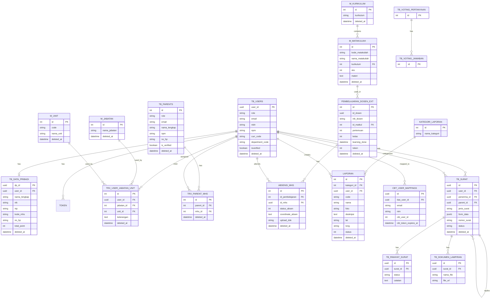

# Struktur Database Sistem Berjalan TIAS/UCL

Dokumen ini memetakan struktur database sistem TIAS/UCL yang sedang berjalan, bukan rancangan
khusus LMS. Sumber pemetaan:

- Model Sequelize pada folder `models/`
- Migrasi pada folder `migrations/`
- Dump SQL yang sedang dipakai sebagai referensi (`tias.sql`)

Catatan penting:

- Banyak relasi di sistem berjalan bersifat relasi logis/aplikasi, bukan selalu FK ketat di
  database.
- Beberapa tabel hanya muncul di dump SQL/migration dan belum punya model Sequelize aktif.
- Dokumen ini dibuat sebagai peta as-is untuk diskusi, bukan DDL final produksi.

## 1. Ringkasan Domain

| Domain | Tabel utama |
| --- | --- |
| User & profil | `tb_users`, `tb_data_pribadi`, `token` |
| Role, jabatan, unit | `m_jabatan`, `m_unit`, `trx_user_jabatan_unit` |
| Orang tua mahasiswa | `tb_parents`, `trx_parent_mhs` |
| Master akademik lokal | `m_kurikulum`, `m_matakuliah` |
| Referensi SIAK lama | `siak_course`, `siak_class`, `siak_curriculum`, `siak_lecturer` |
| Absensi/pembelajaran | `pembelajaran_dosen_ext`, `absensi_mhs` |
| Laporan | `laporan`, `kategori_laporan` |
| Kompetensi | `kategori_sertifikasi`, `kategori_prestasi`, `kategori_profesi`, `tb_sertifikasi`, `tb_tes` |
| Penunjang | `tb_penghargaan`, `tb_anggota_prof` |
| Pendidikan | `tb_pend_formal`, `tb_ip_mhs`, `tb_bimbingan_mhs`, `mhs_bimbingan`, `dosen_pembimbing`, `tb_bahan_ajar_dosen`, `dokumen_bahan_ajar`, `penulis_bahan_ajar` |
| Penelitian | `tb_penelitian`, `anggota_penelitian`, `dokumen_penelitian` |
| Publikasi & HKI | `tb_publikasi_karya`, `penulis_publikasi`, `dokumen_publikasi`, `tb_hki`, `penulis_hki`, `dokumen_hki`, `kategori_hki`, `kategori_publikasi` |
| Pengabdian | `tb_pengabdian`, `anggota_pengabdian`, `dokumen_pengabdian`, `tb_pembicara`, `dokumen_pembicara` |
| Tugas akhir | `ta_pengajuan_sk`, `ta_pendaftaran_kolokium`, `ta_pendaftaran_sidang`, `ta_penilaian_kolokium`, `ta_penilaian_sidang`, `ta_progres` |
| Persuratan | `tb_surat`, `tb_riwayat_surat`, `tb_dokumen_lampiran` |
| E-voting | `tb_voting_pertanyaan`, `tb_voting_jawaban` |
| CBT | `cbt_user_mappings` |
| Validasi dokumen | `validasi_dokumen` |

## 2. User, Profil, Jabatan, dan Parent

### `tb_users`

| Kolom | Keterangan |
| --- | --- |
| `user_id` UUID PK | ID user utama |
| `role` | Role: Admin, Mahasiswa, Dosen, Dosen_Ext, dll |
| `email` | Email login |
| `nidn` | NIDN dosen |
| `npm` | NPM mahasiswa |
| `password` | Password hash |
| `curr_code` | Kode kurikulum/SIAK |
| `department_code` | Kode prodi/departemen |
| `isverified` | Status verifikasi |
| `created_at`, `updated_at`, `deleted_at` | Audit dan soft delete |

### `tb_data_pribadi`

| Kolom | Keterangan |
| --- | --- |
| `dp_id` UUID PK | ID data pribadi |
| `user_id` UUID | Relasi ke `tb_users.user_id` |
| `nama_lengkap`, `jenkel`, `tanggal_lahir`, `tempat_lahir` | Identitas personal |
| `nik`, `nip`, `kode_mhs` | Nomor identitas |
| `email`, `alamat`, `no_hp` | Kontak |
| `image`, `ttd` | File profil/tanda tangan |
| `ipk`, `rank` | Data akademik mahasiswa |
| `point_*`, `total_point` | Poin gamifikasi/portofolio |
| `created_at`, `updated_at`, `deleted_at` | Audit dan soft delete |

### `m_jabatan`, `m_unit`, `trx_user_jabatan_unit`

| Tabel | Fungsi |
| --- | --- |
| `m_jabatan` | Master jabatan |
| `m_unit` | Master unit/fakultas/prodi/unit kerja |
| `trx_user_jabatan_unit` | Mapping user ke jabatan dan unit |

Relasi logis:

```text
tb_users.user_id
  -> tb_data_pribadi.user_id
  -> trx_user_jabatan_unit.user_id
  -> m_jabatan.id
  -> m_unit.id
```

### `tb_parents`, `trx_parent_mhs`

| Tabel | Fungsi |
| --- | --- |
| `tb_parents` | Akun orang tua/wali |
| `trx_parent_mhs` | Relasi parent ke mahasiswa |

Relasi logis:

```text
tb_parents.id -> trx_parent_mhs.parent_id
tb_users.user_id -> trx_parent_mhs.mhs_id
```

Catatan: pada model saat ini `mhs_id` bertipe integer, tetapi relasi Sequelize mengarah ke
`tb_users.user_id` yang UUID. Ini perlu diverifikasi dengan DB aktual.

## 3. Master Akademik dan SIAK Lama

### Master lokal

| Tabel | Kolom penting | Fungsi |
| --- | --- | --- |
| `m_kurikulum` | `id`, `kurikulum` | Master kurikulum lokal |
| `m_matakuliah` | `id`, `kode_matakuliah`, `nama_matakuliah`, `kurikulum`, `sks`, `materi` | Master mata kuliah lokal |

Relasi:

```text
m_kurikulum.id -> m_matakuliah.kurikulum
```

### Referensi SIAK lama

Tabel ini memakai koneksi `config/siak_connection`, bukan koneksi utama TIAS.

| Tabel | Fungsi |
| --- | --- |
| `siak_course` | Master mata kuliah dari SIAK lama |
| `siak_class` | Master kelas |
| `siak_curriculum` | Master kurikulum SIAK |
| `siak_lecturer` | Master dosen SIAK |

Kolom kunci:

| Tabel | Primary/Key utama |
| --- | --- |
| `siak_course` | `code` |
| `siak_class` | `name`, `faculty_code` |
| `siak_curriculum` | `curr_code` |
| `siak_lecturer` | `code` |

## 4. Absensi dan Pembelajaran

### `pembelajaran_dosen_ext`

| Kolom | Keterangan |
| --- | --- |
| `id` PK | ID pembelajaran/pertemuan |
| `id_dosen` UUID | User dosen |
| `nik_dosen` | Identitas dosen dari sistem lama |
| `id_matkul` | Relasi logis ke `m_matakuliah.id` |
| `pertemuan` | Pertemuan ke berapa |
| `kelas` | Kode/nomor kelas |
| `rps_dasar`, `rps_pelaksanaan` | RPS |
| `npm_komti` | Komti |
| `learning_done` | Waktu selesai pembelajaran |
| `token` | Token absensi |
| `status_kelas` | Status kelas |

### `absensi_mhs`

| Kolom | Keterangan |
| --- | --- |
| `id` PK | ID absensi |
| `id_pembelajaran` | Relasi logis ke `pembelajaran_dosen_ext.id` |
| `id_mhs` UUID | Relasi logis ke `tb_users.user_id` |
| `status_absen` | Status kehadiran |
| `coordinate_absen` | Koordinat presensi |
| `upload_dok` | Bukti/dokumen |
| `nilai` | Nilai/status tambahan |

Relasi:

```text
m_matakuliah.id -> pembelajaran_dosen_ext.id_matkul
pembelajaran_dosen_ext.id -> absensi_mhs.id_pembelajaran
tb_users.user_id -> absensi_mhs.id_mhs
```

## 5. Laporan

| Tabel | Fungsi |
| --- | --- |
| `kategori_laporan` | Master kategori laporan |
| `laporan` | Laporan user beserta foto, lokasi, deskripsi, status |

Relasi:

```text
kategori_laporan.id -> laporan.kategori_id
tb_users.user_id -> laporan.user_id
```

Kolom utama `laporan`:

| Kolom | Keterangan |
| --- | --- |
| `id` PK | ID laporan |
| `kategori_id` | Kategori |
| `user_id` UUID | Pembuat laporan |
| `code`, `nama`, `deskripsi` | Identitas laporan |
| `foto` | File dokumentasi |
| `lat`, `long` | Lokasi |
| `status` | Status laporan |

## 6. Pendidikan, Penelitian, Publikasi, HKI, Pengabdian

Tabel-tabel berikut muncul pada dump `tias.sql` dan/atau migration awal. Secara pola,
sebagian besar memakai `user_id` untuk pemilik/anggota dan tabel dokumen/penulis/anggota
sebagai child table.

### Pendidikan

| Tabel | Fungsi |
| --- | --- |
| `tb_pend_formal` | Riwayat pendidikan formal |
| `tb_ip_mhs` | IP mahasiswa |
| `tb_bimbingan_mhs` | Bimbingan mahasiswa |
| `mhs_bimbingan` | Mahasiswa bimbingan |
| `dosen_pembimbing` | Dosen pembimbing |
| `tb_bahan_ajar_dosen` | Bahan ajar dosen |
| `dokumen_bahan_ajar` | Dokumen bahan ajar |
| `penulis_bahan_ajar` | Penulis bahan ajar |

### Penelitian

| Tabel | Fungsi |
| --- | --- |
| `tb_penelitian` | Kegiatan penelitian |
| `anggota_penelitian` | Anggota penelitian |
| `dokumen_penelitian` | Dokumen penelitian |

Relasi logis:

```text
tb_penelitian.id -> anggota_penelitian.penelitian_id
tb_penelitian.id -> dokumen_penelitian.penelitian_id
tb_users.user_id -> anggota_penelitian.user_id
```

### Publikasi dan HKI

| Tabel | Fungsi |
| --- | --- |
| `tb_publikasi_karya` | Publikasi/karya |
| `penulis_publikasi` | Penulis publikasi |
| `dokumen_publikasi` | Dokumen publikasi |
| `kategori_publikasi` | Kategori publikasi |
| `tb_hki` | Data HKI |
| `penulis_hki` | Penulis HKI |
| `dokumen_hki` | Dokumen HKI |
| `kategori_hki` | Kategori HKI |

### Pengabdian dan Pembicara

| Tabel | Fungsi |
| --- | --- |
| `tb_pengabdian` | Kegiatan pengabdian |
| `anggota_pengabdian` | Anggota pengabdian |
| `dokumen_pengabdian` | Dokumen pengabdian |
| `tb_pembicara` | Kegiatan narasumber/pembicara |
| `dokumen_pembicara` | Dokumen pembicara |

Relasi logis:

```text
tb_pengabdian.id -> anggota_pengabdian.pengabdian_id
tb_pengabdian.id -> dokumen_pengabdian.pengabdian_id
tb_pembicara.id -> dokumen_pembicara.pembicara_id
```

### Kompetensi dan Penunjang

| Tabel | Fungsi |
| --- | --- |
| `kategori_sertifikasi` | Kategori sertifikasi |
| `kategori_prestasi` | Kategori prestasi |
| `kategori_profesi` | Kategori profesi |
| `tb_sertifikasi` | Sertifikasi |
| `tb_tes` | Tes/ujian kompetensi |
| `tb_penghargaan` | Penghargaan |
| `tb_anggota_prof` | Keanggotaan profesi |

## 7. Tugas Akhir

| Tabel | Fungsi |
| --- | --- |
| `ta_pengajuan_sk` | Pengajuan SK tugas akhir |
| `ta_pendaftaran_kolokium` | Pendaftaran kolokium |
| `ta_pendaftaran_sidang` | Pendaftaran sidang |
| `ta_penilaian_kolokium` | Penilaian kolokium |
| `ta_penilaian_sidang` | Penilaian sidang |
| `ta_progres` | Progres tugas akhir |

Relasi logis biasanya berpusat pada mahasiswa (`user_id`/`npm`) dan dosen pembimbing/penguji,
tetapi perlu validasi ulang dari DB aktual karena tidak semua model tersedia.

## 8. Persuratan

| Tabel | Fungsi |
| --- | --- |
| `tb_surat` | Surat masuk/keluar |
| `tb_riwayat_surat` | Riwayat status surat |
| `tb_dokumen_lampiran` | Lampiran surat |

Relasi:

```text
tb_users.user_id -> tb_surat.user_id
tb_users.user_id -> tb_surat.penerima_id
tb_surat.id -> tb_surat.parent_id
tb_surat.id -> tb_riwayat_surat.surat_id
tb_surat.id -> tb_dokumen_lampiran.surat_id
```

## 9. Modul Lain

### E-voting

| Tabel | Fungsi |
| --- | --- |
| `tb_voting_pertanyaan` | Pertanyaan voting |
| `tb_voting_jawaban` | Jawaban voting |

Relasi:

```text
tb_voting_pertanyaan.id -> tb_voting_jawaban.question_id
```

### CBT

| Tabel | Fungsi |
| --- | --- |
| `cbt_user_mappings` | Mapping user TIAS ke user CBT |

Relasi:

```text
tb_users.user_id -> cbt_user_mappings.tias_user_id
```

### Validasi Dokumen

| Tabel | Fungsi |
| --- | --- |
| `validasi_dokumen` | Dokumen validasi kegiatan/attachment |

## 10. ERD Ringkas Sistem Berjalan

ERD ini dibuat ringkas agar domain utama terlihat. Tabel child detail yang sangat banyak
dikelompokkan per domain di bagian berikutnya.



## 11. ERD Portofolio Dosen/Mahasiswa

```mermaid
erDiagram
  TB_USERS ||--o{ TB_PEND_FORMAL : owns
  TB_USERS ||--o{ TB_IP_MHS : owns
  TB_USERS ||--o{ TB_SERTIFIKASI : owns
  TB_USERS ||--o{ TB_TES : owns
  TB_USERS ||--o{ TB_PENGHARGAAN : owns
  TB_USERS ||--o{ TB_ANGGOTA_PROF : owns

  KATEGORI_SERTIFIKASI ||--o{ TB_SERTIFIKASI : categorizes
  KATEGORI_PROFESI ||--o{ TB_ANGGOTA_PROF : categorizes
  KATEGORI_PRESTASI ||--o{ TB_PENGHARGAAN : categorizes

  TB_USERS ||--o{ TB_PENELITIAN : creates
  TB_PENELITIAN ||--o{ ANGGOTA_PENELITIAN : has
  TB_PENELITIAN ||--o{ DOKUMEN_PENELITIAN : has
  TB_USERS ||--o{ ANGGOTA_PENELITIAN : member

  TB_USERS ||--o{ TB_PENGABDIAN : creates
  TB_PENGABDIAN ||--o{ ANGGOTA_PENGABDIAN : has
  TB_PENGABDIAN ||--o{ DOKUMEN_PENGABDIAN : has
  TB_USERS ||--o{ ANGGOTA_PENGABDIAN : member

  TB_USERS ||--o{ TB_PUBLIKASI_KARYA : creates
  TB_PUBLIKASI_KARYA ||--o{ PENULIS_PUBLIKASI : has
  TB_PUBLIKASI_KARYA ||--o{ DOKUMEN_PUBLIKASI : has
  KATEGORI_PUBLIKASI ||--o{ TB_PUBLIKASI_KARYA : categorizes

  TB_USERS ||--o{ TB_HKI : creates
  TB_HKI ||--o{ PENULIS_HKI : has
  TB_HKI ||--o{ DOKUMEN_HKI : has
  KATEGORI_HKI ||--o{ TB_HKI : categorizes
```



## 12. Catatan Perapihan Struktur

Beberapa hal yang perlu diverifikasi jika dokumen ini mau dijadikan ERD final:

1. Cocokkan tipe `trx_parent_mhs.mhs_id` dengan `tb_users.user_id`.
2. Pastikan tabel dari dump `tias.sql` yang belum punya model masih aktif dipakai atau hanya legacy.
3. Bedakan tabel lokal TIAS (`m_matakuliah`) dengan tabel SIAK lama (`siak_course`).
4. Untuk integrasi SIAK baru, jangan langsung menimpa struktur sistem berjalan; lebih aman buat
   tabel sync/bridge lalu migrasi modul satu per satu.
5. Banyak tabel memakai soft delete `deleted_at`; query/report harus konsisten menyaring data aktif.
