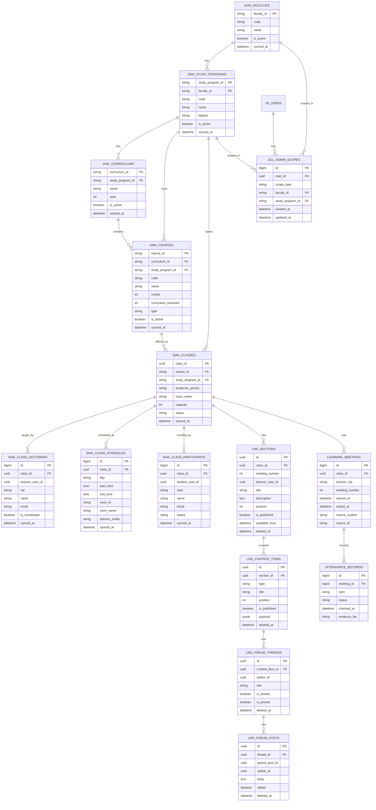

# Struktur Database Integrasi SIAK Baru - UCL / LMS

Dokumen ini adalah rancangan struktur database untuk kebutuhan cut-over UCL dari SIAK lama ke
SIAK baru. Fokusnya adalah membuat data akademik dari SIAK dapat dipakai lintas sistem UCL,
termasuk LMS, admin prodi, admin universitas, jadwal, peserta kelas, dan integrasi presensi.

Prinsip utama:

- Data SIAK disinkronkan ke tabel lokal UCL, lalu UCL membaca dari database lokal.
- Data mata kuliah dibuat sebagai master global, bukan hanya data LMS.
- Kelas kuliah per semester menjadi penghubung antara mata kuliah, dosen, jadwal, peserta,
  LMS, dan presensi.
- Hak akses admin prodi/universitas difilter lewat relasi fakultas/prodi.

## 1. Kelompok Tabel

### A. Master Akademik

| Tabel | Fungsi |
| --- | --- |
| `siak_faculties` | Master fakultas dari SIAK |
| `siak_study_programs` | Master prodi dari SIAK |
| `siak_curriculums` | Master kurikulum per prodi |
| `siak_courses` | Master mata kuliah global UCL |

### B. Kelas Kuliah Per Semester

| Tabel | Fungsi |
| --- | --- |
| `siak_classes` | Kelas kuliah yang dibuka pada semester tertentu |
| `siak_class_lecturers` | Daftar dosen pengampu kelas |
| `siak_class_schedules` | Jadwal perkuliahan kelas |
| `siak_class_participants` | Peserta mahasiswa dalam kelas |

### C. Akses Admin UCL

| Tabel | Fungsi |
| --- | --- |
| `ucl_admin_scopes` | Mapping admin ke level universitas, fakultas, atau prodi |

### D. LMS

| Tabel | Fungsi |
| --- | --- |
| `lms_sections` | Materi/pertemuan LMS per kelas kuliah |
| `lms_content_items` | Item materi LMS: page, PDF, PPT, URL, video, forum, assignment |
| `lms_forum_threads` | Thread forum pada content item tipe forum |
| `lms_forum_posts` | Balasan forum |

### E. Presensi / Absensi

| Tabel | Fungsi |
| --- | --- |
| `learning_meetings` | Bridge pertemuan pembelajaran/presensi ke kelas kuliah |
| `attendance_records` | Presensi mahasiswa per pertemuan |

Catatan: tabel presensi bisa memakai tabel existing seperti `pembelajaran_dosen_ext` dan
`absensi_mhs`, tetapi disarankan diberi kolom penghubung `kelasKuliahId` agar tidak lagi
bergantung pada kombinasi lama seperti `id_matkul + kelas`.

## 2. Detail Struktur Tabel

### `siak_faculties`

| Kolom | Tipe | Keterangan |
| --- | --- | --- |
| `faculty_id` | UUID/String | ID fakultas dari SIAK |
| `code` | String | Kode fakultas |
| `name` | String | Nama fakultas |
| `is_active` | Boolean | Status aktif |
| `synced_at` | DateTime | Waktu sync terakhir |

### `siak_study_programs`

| Kolom | Tipe | Keterangan |
| --- | --- | --- |
| `study_program_id` | UUID/String | ID prodi dari SIAK |
| `faculty_id` | UUID/String | FK ke `siak_faculties` |
| `code` | String | Kode prodi |
| `name` | String | Nama prodi |
| `degree` | String | Jenjang, misalnya S1/S2/D3 |
| `is_active` | Boolean | Status aktif |
| `synced_at` | DateTime | Waktu sync terakhir |

### `siak_curriculums`

| Kolom | Tipe | Keterangan |
| --- | --- | --- |
| `curriculum_id` | UUID/String | ID kurikulum dari SIAK |
| `study_program_id` | UUID/String | FK ke `siak_study_programs` |
| `name` | String | Nama kurikulum |
| `year` | Integer | Tahun kurikulum |
| `is_active` | Boolean | Kurikulum aktif/tidak |
| `synced_at` | DateTime | Waktu sync terakhir |

### `siak_courses`

| Kolom | Tipe | Keterangan |
| --- | --- | --- |
| `course_id` | UUID/String | ID mata kuliah dari SIAK |
| `curriculum_id` | UUID/String | FK ke `siak_curriculums` |
| `study_program_id` | UUID/String | FK langsung untuk filter cepat admin prodi |
| `code` | String | Kode mata kuliah |
| `name` | String | Nama mata kuliah |
| `credits` | Integer | SKS |
| `curriculum_semester` | Integer | Semester kurikulum |
| `type` | String | Wajib/pilihan/praktikum/dll |
| `is_active` | Boolean | Status aktif |
| `synced_at` | DateTime | Waktu sync terakhir |

### `siak_classes`

| Kolom | Tipe | Keterangan |
| --- | --- | --- |
| `class_id` | UUID | `kelasKuliahId`, kunci utama dari SIAK |
| `course_id` | UUID/String | FK ke `siak_courses` |
| `study_program_id` | UUID/String | FK untuk filter cepat admin prodi |
| `academic_period` | String | Semester/periode, misalnya `20241` |
| `class_name` | String | Nama kelas, misalnya `TI-3A` |
| `capacity` | Integer | Kapasitas kelas |
| `status` | String | Aktif/tutup/batal |
| `synced_at` | DateTime | Waktu sync terakhir |

### `siak_class_lecturers`

| Kolom | Tipe | Keterangan |
| --- | --- | --- |
| `id` | BigInt | PK lokal |
| `class_id` | UUID | FK ke `siak_classes` |
| `lecturer_user_id` | UUID | Opsional, jika SIAK punya mapping ke `tb_users.user_id` |
| `nip` | String | NIP dosen, dipakai untuk cocokkan `req.user.nip` |
| `name` | String | Nama dosen |
| `email` | String | Email dosen |
| `is_coordinator` | Boolean | Dosen koordinator atau bukan |
| `synced_at` | DateTime | Waktu sync terakhir |

### `siak_class_schedules`

| Kolom | Tipe | Keterangan |
| --- | --- | --- |
| `id` | BigInt | PK lokal |
| `class_id` | UUID | FK ke `siak_classes` |
| `day` | String | Senin/Selasa/dst |
| `start_time` | Time | Jam mulai |
| `end_time` | Time | Jam selesai |
| `room_id` | UUID/String | Opsional, ID ruang |
| `room_name` | String | Nama ruang |
| `delivery_mode` | String | Offline/online/hybrid |
| `synced_at` | DateTime | Waktu sync terakhir |

### `siak_class_participants`

| Kolom | Tipe | Keterangan |
| --- | --- | --- |
| `id` | BigInt | PK lokal |
| `class_id` | UUID | FK ke `siak_classes` |
| `student_user_id` | UUID | Opsional, jika SIAK punya mapping ke `tb_users.user_id` |
| `npm` | String | NPM mahasiswa, dipakai untuk cocokkan `req.user.npm` |
| `name` | String | Nama mahasiswa |
| `email` | String | Email mahasiswa |
| `status` | String | Aktif/batal/drop/dll |
| `synced_at` | DateTime | Waktu sync terakhir |

### `ucl_admin_scopes`

| Kolom | Tipe | Keterangan |
| --- | --- | --- |
| `id` | BigInt | PK lokal |
| `user_id` | UUID | FK ke `tb_users.user_id` |
| `scope_type` | String | `university`, `faculty`, atau `study_program` |
| `faculty_id` | UUID/String | Wajib untuk admin fakultas |
| `study_program_id` | UUID/String | Wajib untuk admin prodi |
| `created_at` | DateTime | Waktu dibuat |
| `updated_at` | DateTime | Waktu update |

Aturan akses:

- `scope_type = university`: lihat semua fakultas/prodi/mata kuliah/kelas.
- `scope_type = faculty`: lihat data dalam satu fakultas.
- `scope_type = study_program`: lihat data dalam satu prodi.

### `lms_sections`

| Kolom | Tipe | Keterangan |
| --- | --- | --- |
| `id` | UUID | PK |
| `class_id` | UUID | FK ke `siak_classes.class_id` |
| `meeting_number` | Integer | Pertemuan ke-1, 2, dst |
| `lecturer_user_id` | UUID | Pembuat materi, dari `tb_users.user_id` |
| `title` | String | Judul section |
| `description` | Text | Deskripsi |
| `position` | Integer | Urutan |
| `is_published` | Boolean | Draft/publish |
| `available_from` | DateTime | Jadwal tampil |
| `created_at` | DateTime | Waktu dibuat |
| `updated_at` | DateTime | Waktu update |
| `deleted_at` | DateTime | Soft delete |

### `lms_content_items`

| Kolom | Tipe | Keterangan |
| --- | --- | --- |
| `id` | UUID | PK |
| `section_id` | UUID | FK ke `lms_sections` |
| `type` | Enum | `page`, `pdf`, `ppt`, `video`, `url`, `forum`, `exam`, `assignment` |
| `title` | String | Judul item |
| `position` | Integer | Urutan |
| `is_published` | Boolean | Draft/publish |
| `payload` | JSONB | Data spesifik per tipe item |
| `created_at` | DateTime | Waktu dibuat |
| `updated_at` | DateTime | Waktu update |
| `deleted_at` | DateTime | Soft delete |

### `learning_meetings`

| Kolom | Tipe | Keterangan |
| --- | --- | --- |
| `id` | BigInt/Integer | PK lokal |
| `class_id` | UUID | FK ke `siak_classes.class_id` |
| `lecturer_nip` | String | NIP dosen pengajar pertemuan |
| `meeting_number` | Integer | Pertemuan ke-1, 2, dst |
| `started_at` | DateTime | Waktu mulai |
| `ended_at` | DateTime | Waktu selesai |
| `source_system` | String | Sumber data, misalnya `presensi` |
| `source_id` | String | ID asli dari sistem presensi |

### `attendance_records`

| Kolom | Tipe | Keterangan |
| --- | --- | --- |
| `id` | BigInt/Integer | PK lokal |
| `meeting_id` | BigInt/Integer | FK ke `learning_meetings` |
| `npm` | String | NPM mahasiswa |
| `status` | String | Hadir/izin/sakit/alpa |
| `checked_at` | DateTime | Waktu presensi |
| `evidence_file` | String | Opsional, file bukti |

## 3. ERD Mermaid



## 4. Mapping ke Tabel LMS Saat Ini

Implementasi LMS saat ini sudah punya beberapa tabel dengan nama:

| Saat ini | Rancangan target |
| --- | --- |
| `siak_v2_classes.kelasKuliahId` | `siak_classes.class_id` |
| `siak_v2_classes.kode_matakuliah` | Relasi ke `siak_courses.code` |
| `siak_v2_classes.nama_matakuliah` | Relasi ke `siak_courses.name` |
| `siak_v2_classes.nama_kelas` | `siak_classes.class_name` |
| `siak_v2_classes.dosen_pengampu_nip` JSONB | `siak_class_lecturers` |
| `siak_v2_participants` | `siak_class_participants` |
| `lms_sections.kelasKuliahId` | `lms_sections.class_id` |

Untuk fase development, tabel yang ada sekarang masih valid. Untuk target lintas UCL,
disarankan melakukan normalisasi bertahap agar fakultas, prodi, kurikulum, mata kuliah,
dosen, jadwal, dan peserta tidak ditumpuk dalam satu tabel JSON.

## 5. Endpoint Sync yang Disarankan dari SIAK

Minimal ada dua opsi.

### Opsi A - Satu endpoint bulk

`GET /api/v2/ucl/sync-akademik?academic_period=20241`

Response:

```json
{
  "faculties": [],
  "study_programs": [],
  "curriculums": [],
  "courses": [],
  "classes": [],
  "class_lecturers": [],
  "class_schedules": [],
  "class_participants": []
}
```

### Opsi B - Endpoint dipisah

```text
GET /api/v2/ucl/faculties
GET /api/v2/ucl/study-programs
GET /api/v2/ucl/curriculums
GET /api/v2/ucl/courses
GET /api/v2/ucl/classes?academic_period=20241
GET /api/v2/ucl/class-lecturers?academic_period=20241
GET /api/v2/ucl/class-schedules?academic_period=20241
GET /api/v2/ucl/class-participants?academic_period=20241
```

Opsi B lebih aman untuk data besar karena bisa disinkronkan bertahap.

## 6. Index dan Constraint Penting

Disarankan:

- `siak_study_programs.faculty_id`
- `siak_courses.study_program_id`
- `siak_courses.code`
- `siak_classes.course_id`
- `siak_classes.study_program_id`
- `siak_classes.academic_period`
- Unique `siak_classes(class_id)`
- Unique `siak_class_lecturers(class_id, nip)`
- Unique `siak_class_participants(class_id, npm)`
- `siak_class_participants.npm`
- `lms_sections(class_id, meeting_number)`
- `lms_content_items(section_id, position)`
- `learning_meetings(class_id, meeting_number)`
- Unique `attendance_records(meeting_id, npm)`

## 7. Alur Akses

### Admin Universitas

```text
tb_users.user_id
  -> ucl_admin_scopes(scope_type = university)
  -> boleh lihat semua data akademik
```

### Admin Prodi

```text
tb_users.user_id
  -> ucl_admin_scopes(scope_type = study_program)
  -> siak_study_programs.study_program_id
  -> siak_courses / siak_classes dalam prodi tersebut
```

### Dosen

```text
req.user.nip
  -> siak_class_lecturers.nip
  -> siak_classes.class_id
  -> lms_sections / lms_content_items
```

### Mahasiswa

```text
req.user.npm
  -> siak_class_participants.npm
  -> siak_classes.class_id
  -> lms_sections / lms_content_items yang publish
```

### Presensi

```text
siak_classes.class_id
  -> learning_meetings.class_id
  -> attendance_records.meeting_id
```

Dengan struktur ini, data presensi boleh tetap berasal dari sistem presensi, tetapi sudah
punya anchor yang sama dengan LMS dan akademik, yaitu `class_id` / `kelasKuliahId`.
